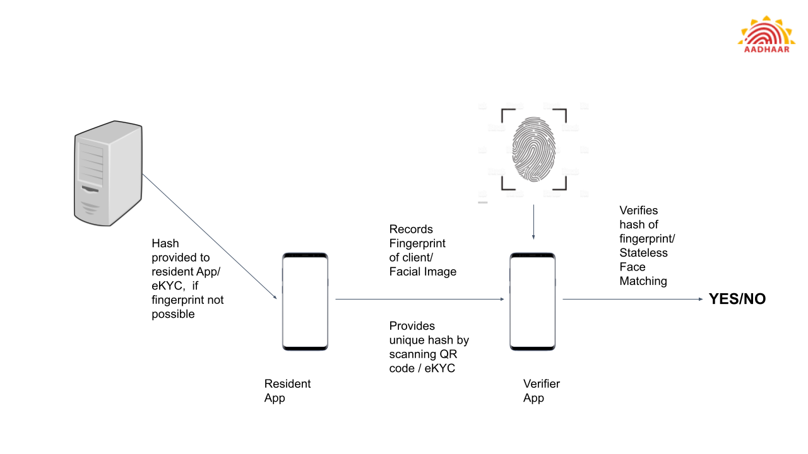

Hackathon Submission for the UIDAI Hackathon 2021 by Team 202ACCEPTED

## Theme 2 : Problem Statement 4
### 100% Authentication success in Rural India

<br>

## Important Links

* [Compiled APKs (Verifier and Resident)](https://drive.google.com/drive/folders/1Nm-D_hOP8DvX-84G0MmmSq87CFw2rvel?usp=sharing)
* Presentation of Solution
* [Screenshots of App](https://drive.google.com/drive/folders/1yqrvqmFdz82PvhLRp3VgP-M9xBx-h8UG?usp=sharing)
* [Video Recording of Apps](https://drive.google.com/drive/folders/1322cyvZyhc_71UxXgd9phQR2dFMM7lZ2?usp=sharing)
* [Google Drive Link](https://drive.google.com/drive/u/1/folders/1UCbi8d1H3KmbGus2gnI6PwYWdqzX4PD0)


<br>

###  App Flow 

#### Scenario
* Resident approaches PDS shop for Ration.
* Located in Rural India with no 3G/4G connectivity.

#### Verifier APP
* Uses OTP Authentication as primary mechanism.
* Resident Shares Virtual Aadhaar Number / Offline eKYC with PDS shop.
* Application facilitates OTP Authentication, Online/Offline Face Authentication for Completely inclusive authentication.

#### Resident App
* OTP verification for secure login.
* Facilitates generation of Virtual Aadhaar Number with Captcha and OTP based security.
* Facilitates downloading eKYC XML to share with Verifier using QR code for OFfline Face Auth.

<br>

### General

This is a project submitted to the UIDAI Aadhar Authentication Hackathon. We try to explore authentication options in a variety of ways, while providing a seamless transition from online to offline. The methods of Authentication are:
- Fingerprint Matching (Simulated due to lack of fingerprint sensors)
- Aadhaar based OTP matching (Via SMS or email)
- Stateless Face Matching

The navigational structure of the project looks something like this

```
resident_app
├── android/..
├── assets/..
├── lib
│   ├── camera_screen.dart
│   ├── home_screen.dart
│   ├── login_screen.dart
│   ├── main.dart
│   └── resident_data.dart
├── pubspec.lock
└── pubspec.yaml
```

with the files in `lib` containing the important application data

<br>



### Approach

#### Offline Fingerprint Authentication
* UIDAI server generates a secure hash of the recorded fingerprint and sends it to the resident application as unique id (at setup).
* Verifier accepts hash value from resident application using QR code.
* Verifier also takes actual fingerprint and computes its hash.
* If both hashes match, authenticity is proven completely offline (extremely fast).

#### Offline Face Match
* If fingerprint authentication not possible, Offline Stateless Face match implemented from the API
* Resident app will obtain eKYC XML from UIDAI server (at setup).
* Stateless match performed as already supported in the Verifier App.

<br>

### Tech Stack
We use a modified Flutter (Kotlin/Swift) Techstack implemented mostly in flutter with a few calls to Native code in Kotlin. All use of API's is limited to those provided by the UIDAI for the purposes of the Hackathon due to safety reasons.

#### API Usage
- OTP API to simulate Fingerprint Hash (as mentioned in the docs)
- OTP API for Mobile phone Auth
- eKYC API for Stateless Matching.
- Face RD APK for Online/Offline
- Aadhaar Auth API

<br>

### About Us - 202ACCEPTED
- Omkar Prabhune, CSE Junior at VIT Pune
- Atharva Rajadhyaksha, Instrumentation Junior at VIT Pune
